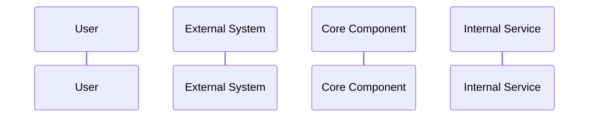
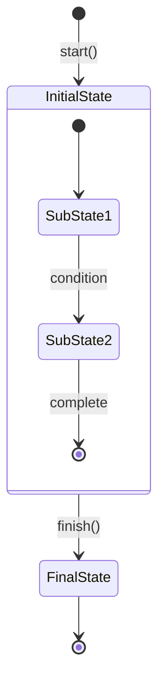

# LivekitexAgent Diagram Templates and Standards

## Overview

This document provides Mermaid diagram templates and standards for creating consistent, professional documentation diagrams for the LivekitexAgent system.

## Available Diagram Templates

### 1. System Overview Diagram
**File**: `system-overview.mmd`
**Type**: Component/Architecture diagram
**Purpose**: High-level system architecture showing major components and relationships

**Usage**:
- Initial system understanding
- Architecture presentations
- Onboarding documentation
- System boundary identification

**Key Elements**:
- External systems (LiveKit, OpenAI, External Tools)
- Core components (WorkerManager, AgentSession, Agent)
- Tool system (FunctionTool, ToolRegistry, RunContext)
- Infrastructure (WorkerSupervisor, JobContext, HealthServer)

**Color Scheme**:
- External systems: Light blue (`#e1f5fe`)
- Core components: Light purple (`#f3e5f5`)
- Application layer: Light green (`#e8f5e8`)
- Tool system: Light orange (`#fff3e0`)
- Infrastructure: Light pink (`#fce4ec`)

### 2. Agent Initialization Sequence
**File**: `agent-initialization.mmd`
**Type**: Sequence diagram
**Purpose**: Step-by-step agent startup process

**Usage**:
- Understanding agent lifecycle
- Debugging startup issues
- Implementation guidance
- Process documentation

**Key Phases**:
1. Job setup phase
2. Agent creation phase
3. Session initialization phase
4. External connections phase
5. Ready state

**Participants**:
- User, WorkerManager, JobContext, AgentSession, Agent Configuration, LiveKit Server, OpenAI APIs, Tool Registry

### 3. Agent Lifecycle States
**File**: `agent-lifecycle.mmd`
**Type**: State diagram
**Purpose**: Agent state transitions and conversation states

**Usage**:
- Understanding agent behavior
- Error handling patterns
- State management implementation
- Debugging state issues

**Major States**:
- Created → Configured → Active → Inactive → Destroyed
- Conversation substates: Idle, Listening, Processing, Thinking, ToolExecution, Responding, Speaking, Interrupted

**State Categories**:
- Initialization states (Created, Configured)
- Runtime states (Active with conversation substates)
- Management states (Paused, Inactive)
- Error handling states
- Terminal state (Destroyed)

### 4. Conversation Flow Sequence
**File**: `conversation-flow.mmd`
**Type**: Sequence diagram
**Purpose**: Real-time conversation handling including interruptions

**Usage**:
- Understanding real-time interactions
- Debugging conversation issues
- Integration implementation
- Performance analysis

**Key Features**:
- Real-time audio processing
- OpenAI Realtime WebSocket integration
- Tool execution within conversation
- Interruption handling
- Audio streaming (PCM16)

**Message Types**:
- `input_audio_buffer.append/commit`
- `conversation.item.input_audio_transcription.completed`
- `response.function_call_arguments.delta`
- `response.audio.delta`
- `response.cancel` (for interruptions)

### 5. Integration Architecture
**File**: `integration-architecture.mmd`
**Type**: Component diagram
**Purpose**: External system integration patterns

**Usage**:
- Integration planning
- API documentation
- Architecture decisions
- Troubleshooting connections

**Integration Points**:
- LiveKit Infrastructure (WebRTC, STUN/TURN, Media Relay)
- OpenAI Integration (Realtime WebSocket, REST API, Function Calling)
- Agent Core orchestration

**Data Flow Types**:
- Audio streams (PCM16 16kHz)
- WebSocket messages (JSON + Base64 Audio)
- HTTP/JSON API requests
- WebRTC signaling (SDP/ICE)

### 6. Tool Execution Flow
**File**: `tool-execution-flow.mmd`
**Type**: Sequence diagram
**Purpose**: Function tool execution process with context

**Usage**:
- Tool implementation guidance
- Debugging tool execution
- Understanding RunContext usage
- Error handling patterns

**Execution Steps**:
1. Tool lookup and validation
2. RunContext creation and data loading
3. Parameter validation
4. Tool execution with external API calls
5. Result processing and state updates
6. Error handling scenarios

### 7. Performance Monitoring Architecture
**File**: `performance-monitoring.mmd`
**Type**: Component diagram
**Purpose**: Performance monitoring and optimization system

**Usage**:
- Performance optimization
- Monitoring implementation
- Alert configuration
- Dashboard design

**Monitoring Stack**:
- Real-time Monitor (250ms intervals)
- Metrics Collector (ETS storage)
- Health Server (HTTP endpoints)
- External integrations (Prometheus, Grafana, PagerDuty)

**Performance Targets**:
- Audio Processing: < 50ms
- End-to-End Response: < 100ms
- Audio Quality: > 4.0/5.0
- Memory Usage: < 500MB/session

## Diagram Creation Standards

### Mermaid Syntax Guidelines

#### Graph Direction
```mermaid
graph TB    # Top to Bottom (preferred for system overviews)
graph LR    # Left to Right (good for process flows)
graph TD    # Top Down (alias for TB)
```

#### Subgraph Organization
```mermaid
subgraph "Category Name"
    direction TB
    Component1[Component<br/>Description]
    Component2[Component<br/>Description]
end
```

#### Node Styling Templates
```mermaid
%% External systems
classDef external fill:#e1f5fe,stroke:#01579b,stroke-width:2px

%% Core components
classDef core fill:#f3e5f5,stroke:#4a148c,stroke-width:2px

%% Application layer
classDef app fill:#e8f5e8,stroke:#1b5e20,stroke-width:2px

%% Tool system
classDef tools fill:#fff3e0,stroke:#e65100,stroke-width:2px

%% Infrastructure
classDef infra fill:#fce4ec,stroke:#880e4f,stroke-width:2px
```

#### Connection Types
```mermaid
A --> B          # Solid arrow (direct connection)
A <--> B         # Bidirectional solid (two-way communication)
A -.-> B         # Dashed arrow (indirect/data flow)
A --- B          # Solid line (association)
A -.->|"Label"| B # Labeled dashed arrow (annotated flow)
```

### Sequence Diagram Standards

#### Participant Organization


#### Message Types
```mermaid
A->>B: Synchronous call
A-->>B: Synchronous return
A->>+B: Activate lifeline
B-->>-A: Deactivate lifeline
```

#### Grouping and Notes
```mermaid
Note over A,B: Process description
Note right of A: Side note

rect rgb(255, 240, 240)
    Note over A: Error scenario
    A->>B: Error handling
end
```

### State Diagram Standards

#### State Definition


#### State Notes
```mermaid
note right of State
    Additional information
    about this state
end note
```

## Diagram Generation Process

### 1. Source File Management
```bash
# Source files location
docs/diagrams/src/*.mmd

# Generated output location
docs/diagrams/*.svg
```

### 2. Generation Script Usage
```bash
# Generate all diagrams
./scripts/generate-diagrams.sh

# Generate specific diagram
mmdc -i docs/diagrams/src/system-overview.mmd -o docs/diagrams/system-overview.svg
```

### 3. Quality Validation
```bash
# Validate Mermaid syntax
mmdc --help validate docs/diagrams/src/*.mmd

# Check SVG output quality
file docs/diagrams/*.svg
```

### 4. Integration with Documentation
```markdown
# Embedding diagrams in documentation


# With alt text and sizing

```

## Template Usage Guidelines

### When to Use Each Template

#### System Overview
- Initial documentation sections
- Architecture decision documents
- Onboarding materials
- High-level presentations

#### Sequence Diagrams
- Process documentation
- API interaction guides
- Troubleshooting guides
- Implementation tutorials

#### State Diagrams
- Behavior documentation
- Error handling guides
- State management implementation
- Testing scenarios

#### Integration Architecture
- Integration guides
- API documentation
- Deployment documentation
- Performance analysis

### Customization Guidelines

#### Adding New Components
1. Follow existing naming conventions
2. Use appropriate color categories
3. Maintain consistent node formatting
4. Add descriptive labels

#### Modifying Existing Diagrams
1. Preserve overall structure
2. Update related documentation
3. Validate syntax before committing
4. Test SVG generation

#### Creating New Templates
1. Follow established patterns
2. Document purpose and usage
3. Provide customization examples
4. Test with different content

## Best Practices

### Content Guidelines
- Keep diagrams focused on specific concepts
- Use consistent terminology with documentation
- Include enough detail for understanding without cluttering
- Provide clear labels and annotations

### Visual Guidelines
- Maintain consistent color schemes
- Use readable font sizes in generated SVGs
- Ensure adequate spacing between elements
- Test readability at different zoom levels

### Maintenance Guidelines
- Update diagrams when system changes
- Validate generated SVGs after updates
- Keep source files under version control
- Document any custom modifications

### Accessibility Guidelines
- Provide meaningful alt text for all diagrams
- Ensure sufficient color contrast
- Include text descriptions alongside complex diagrams
- Test with screen readers when possible

This template system ensures consistent, professional diagrams that effectively communicate LivekitexAgent architecture and processes while maintaining visual coherence across all documentation.