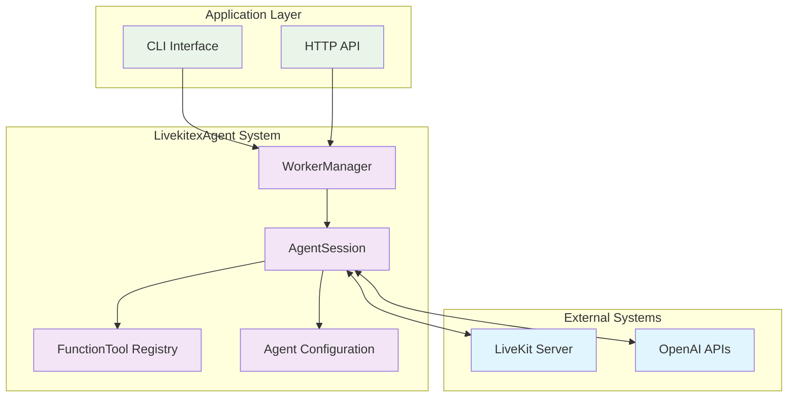
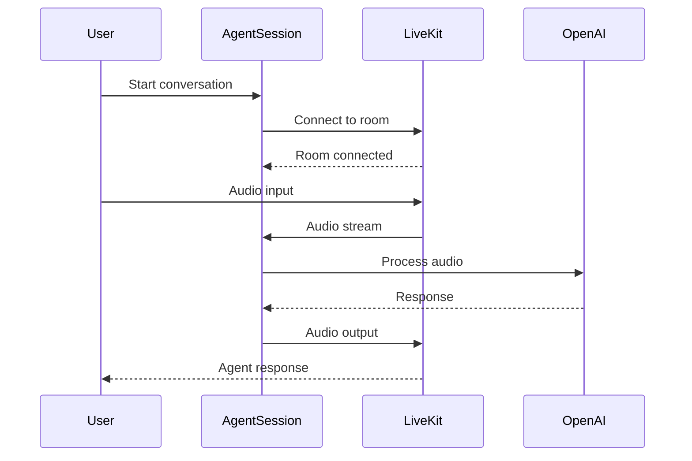
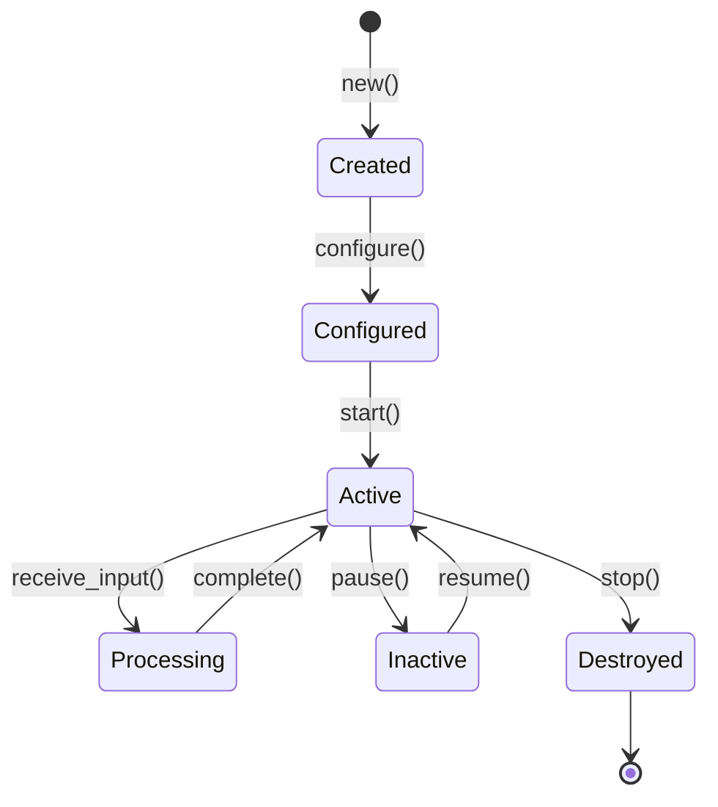
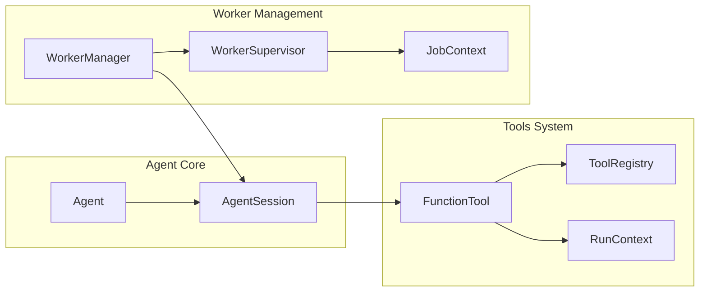

# LivekitexAgent Documentation Standards

## Overview

This document establishes the standards and templates for creating comprehensive documentation for the LivekitexAgent system. It defines formats, styles, and structures to ensure consistency across all documentation artifacts.

## Documentation Architecture

### Multi-Layered Approach

#### Layer 1: Basic Overview (Quick Start)
- **Audience**: Developers new to the system
- **Content**: High-level concepts, basic examples, getting started guides
- **Format**: Simple explanations with minimal technical jargon
- **Diagrams**: Basic flowcharts and overview diagrams

#### Layer 2: Developer Reference (Technical Details)
- **Audience**: Experienced developers implementing features
- **Content**: Detailed API documentation, architecture patterns, integration guides
- **Format**: Comprehensive technical documentation with code examples
- **Diagrams**: Detailed sequence diagrams, component interactions, data flows

#### Layer 3: Deep Technical (Appendices)
- **Audience**: System architects, DevOps engineers, performance specialists
- **Content**: Performance benchmarks, deployment patterns, troubleshooting
- **Format**: In-depth technical analysis with metrics and best practices
- **Diagrams**: Complex system architecture, performance charts, deployment diagrams

## Documentation Standards

### File Structure and Naming

#### Primary Documentation Files
```
docs/
├── flow.md                    # Main comprehensive flow documentation
├── system-components.md       # System architecture and components
├── integration-points.md      # External API and protocol integration
├── quickstart.md             # Getting started guide
├── diagrams/                 # Generated SVG diagrams
│   ├── system-overview.svg
│   ├── agent-lifecycle.svg
│   ├── conversation-flow.svg
│   └── src/                  # Mermaid source files
│       ├── system-overview.mmd
│       ├── agent-lifecycle.mmd
│       └── conversation-flow.mmd
├── performance/              # Performance documentation
│   ├── benchmarks.md
│   ├── latency-analysis.md
│   └── scaling-patterns.md
└── appendices/              # Technical deep-dives
    ├── deployment-patterns.md
    ├── troubleshooting.md
    └── advanced-configuration.md
```

#### Naming Conventions
- **Files**: kebab-case with descriptive names (`system-components.md`)
- **Sections**: Title case with consistent hierarchy (`## System Architecture`)
- **Code blocks**: Language-specific syntax highlighting
- **Diagrams**: Descriptive names matching content (`agent-lifecycle.svg`)

### Content Structure Standards

#### Document Header Template
```markdown
# Document Title

## Overview
Brief description of the document's purpose and scope.

## Prerequisites
- List of required knowledge
- Dependencies that must be understood first
- Links to foundational documents

## Table of Contents
- Generated automatically or manually maintained
- Links to major sections
- Cross-references to related documents

[Main Content Sections...]

## Related Documentation
- Links to related files
- Cross-references to other layers
- External resources and references
```

#### Section Organization
1. **Overview**: Purpose and context
2. **Core Concepts**: Fundamental understanding required
3. **Detailed Content**: Main technical information
4. **Examples**: Practical implementations
5. **Best Practices**: Recommendations and patterns
6. **Troubleshooting**: Common issues and solutions
7. **References**: Links and additional resources

### Writing Style Guidelines

#### Technical Writing Standards
- **Clarity**: Use clear, concise language
- **Consistency**: Maintain consistent terminology throughout
- **Completeness**: Cover all necessary information for the target audience
- **Accuracy**: Ensure technical correctness and up-to-date information

#### Voice and Tone
- **Professional**: Maintain a professional, helpful tone
- **Active Voice**: Prefer active voice over passive
- **Present Tense**: Use present tense for describing current functionality
- **Direct**: Be direct and specific in instructions and explanations

#### Formatting Standards
- **Headers**: Use consistent header hierarchy (H1 → H2 → H3 → H4)
- **Code Blocks**: Always specify language for syntax highlighting
- **Lists**: Use bullet points for unordered lists, numbers for sequential steps
- **Emphasis**: Use **bold** for important terms, *italics* for emphasis
- **Links**: Use descriptive link text, avoid "click here"

## Diagram Standards and Templates

### Mermaid Diagram Types

#### 1. System Overview Diagrams
**Template**: `docs/diagrams/src/template-system-overview.mmd`


#### 2. Sequence Diagrams
**Template**: `docs/diagrams/src/template-sequence.mmd`


#### 3. State Diagrams
**Template**: `docs/diagrams/src/template-state.mmd`


#### 4. Component Diagrams
**Template**: `docs/diagrams/src/template-components.mmd`


### Diagram Generation Standards

#### SVG Export Requirements
- **Format**: SVG for scalability and web compatibility
- **Naming**: Descriptive filenames matching content
- **Organization**: Source `.mmd` files in `src/` subdirectory
- **Quality**: High-resolution output suitable for documentation

#### Color Scheme Standards
```mermaid
classDef external fill:#e1f5fe,stroke:#01579b,stroke-width:2px
classDef core fill:#f3e5f5,stroke:#4a148c,stroke-width:2px
classDef app fill:#e8f5e8,stroke:#1b5e20,stroke-width:2px
classDef data fill:#fff3e0,stroke:#e65100,stroke-width:2px
classDef process fill:#fce4ec,stroke:#880e4f,stroke-width:2px
```

**Color Categories**:
- **External Systems**: Light blue (`#e1f5fe`)
- **Core Components**: Light purple (`#f3e5f5`)
- **Application Layer**: Light green (`#e8f5e8`)
- **Data Storage**: Light orange (`#fff3e0`)
- **Processing**: Light pink (`#fce4ec`)

## Code Examples Standards

### Code Block Formatting

#### Language Specification
Always specify the language for proper syntax highlighting:

````markdown
```elixir
# Elixir code example
agent = LivekitexAgent.Agent.new(
  instructions: "You are a helpful assistant",
  tools: [:get_weather]
)
```

```bash
# Shell commands
export OPENAI_API_KEY="your-key-here"
elixir examples/minimal_assistant.exs
```

```yaml
# Configuration files
config:
  livekit:
    server_url: "wss://example.livekit.cloud"
```
````

#### Example Structure Template
```markdown
### Example: [Descriptive Title]

**Purpose**: Brief description of what this example demonstrates

**Prerequisites**:
- List required setup steps
- Environment variables needed
- Dependencies that must be installed

**Implementation**:
```elixir
# Complete, runnable code example
# with inline comments explaining key concepts
```

**Expected Output**:
```
Sample output or behavior description
```

**Explanation**:
- Step-by-step breakdown of the code
- Key concepts highlighted
- Common variations or alternatives
```

### Configuration Examples

#### Environment Variables Template
```bash
# Required variables
export LIVEKIT_URL="wss://your-livekit-server.com"
export LIVEKIT_API_KEY="your-api-key"
export LIVEKIT_API_SECRET="your-api-secret"
export OPENAI_API_KEY="your-openai-key"

# Optional configuration
export OPENAI_LLM_MODEL="gpt-4-turbo-preview"
export MAX_CONCURRENT_JOBS="10"
export LOG_LEVEL="info"
```

#### Configuration File Template
```elixir
# config/prod.exs
import Config

config :livekitex_agent,
  # LiveKit configuration with environment variables
  livekit: [
    server_url: System.get_env("LIVEKIT_URL"),
    api_key: System.get_env("LIVEKIT_API_KEY"),
    api_secret: System.get_env("LIVEKIT_API_SECRET")
  ],

  # OpenAI provider settings
  openai: [
    api_key: System.get_env("OPENAI_API_KEY"),
    llm_model: System.get_env("OPENAI_LLM_MODEL") || "gpt-4"
  ]
```

## Cross-Reference Standards

### Internal Link Format
- **Relative paths**: Use relative paths for internal documentation
- **Anchor links**: Use descriptive anchor names for section links
- **File references**: Include file paths when referencing code files

```markdown
See the [System Components](./system-components.md#core-system-components)
documentation for detailed architecture information.

For configuration details, check the
[Integration Points](./integration-points.md#configuration-management) section.

Implementation example in [`lib/livekitex_agent/agent.ex`](../lib/livekitex_agent/agent.ex).
```

### External Reference Format
```markdown
## External Resources

- [LiveKit Documentation](https://docs.livekit.io/) - Official LiveKit documentation
- [OpenAI Realtime API](https://platform.openai.com/docs/guides/realtime) - OpenAI real-time API guide
- [Elixir GenServer Guide](https://hexdocs.pm/elixir/GenServer.html) - GenServer documentation
```

## Quality Assurance Standards

### Documentation Review Checklist

#### Content Quality
- [ ] **Accuracy**: All technical information is correct and up-to-date
- [ ] **Completeness**: All necessary information is included for the target audience
- [ ] **Clarity**: Content is clear and understandable for the intended reader
- [ ] **Consistency**: Terminology and style are consistent throughout

#### Structure and Format
- [ ] **Headers**: Consistent header hierarchy and formatting
- [ ] **Code blocks**: All code examples have proper language specification
- [ ] **Links**: All internal and external links are functional
- [ ] **Diagrams**: All referenced diagrams exist and are properly generated

#### Technical Validation
- [ ] **Code examples**: All code examples compile and run correctly
- [ ] **Configuration**: All configuration examples are valid and tested
- [ ] **Commands**: All shell commands and procedures are verified
- [ ] **Dependencies**: All mentioned dependencies and versions are correct

### Update and Maintenance Standards

#### Version Control
- **Commit messages**: Clear, descriptive commit messages for documentation changes
- **Change tracking**: Track significant changes in documentation alongside code changes
- **Review process**: Peer review for significant documentation updates

#### Maintenance Schedule
- **Regular reviews**: Quarterly review of documentation accuracy
- **Dependency updates**: Update documentation when dependencies change
- **Feature additions**: Update documentation as part of feature development process

This documentation standard ensures consistent, high-quality documentation that serves multiple audiences while maintaining technical accuracy and usability.