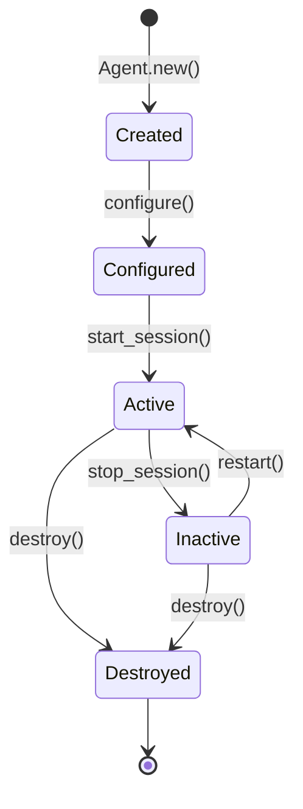
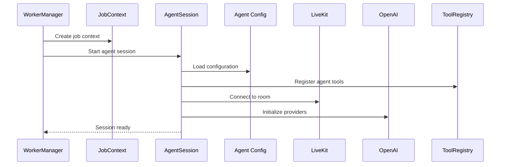
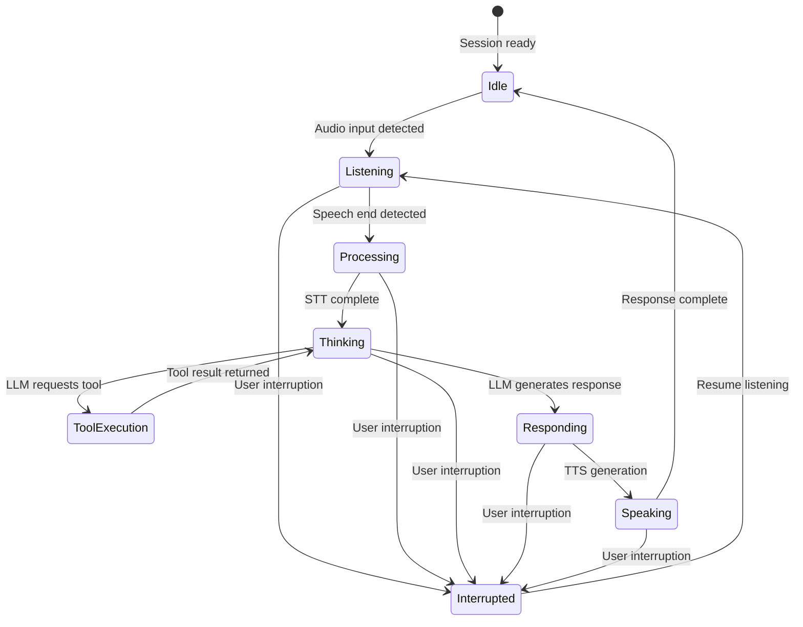
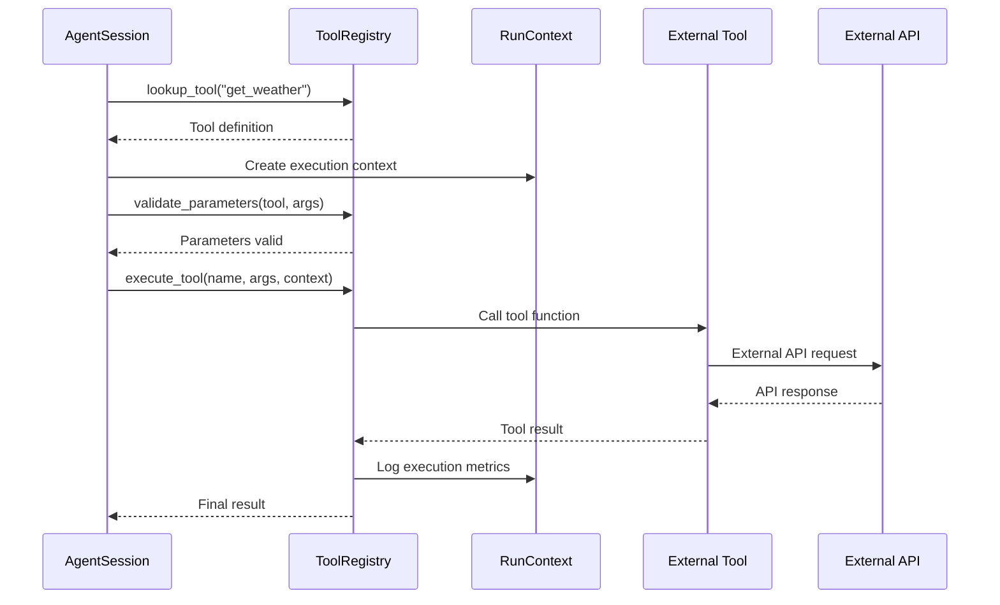
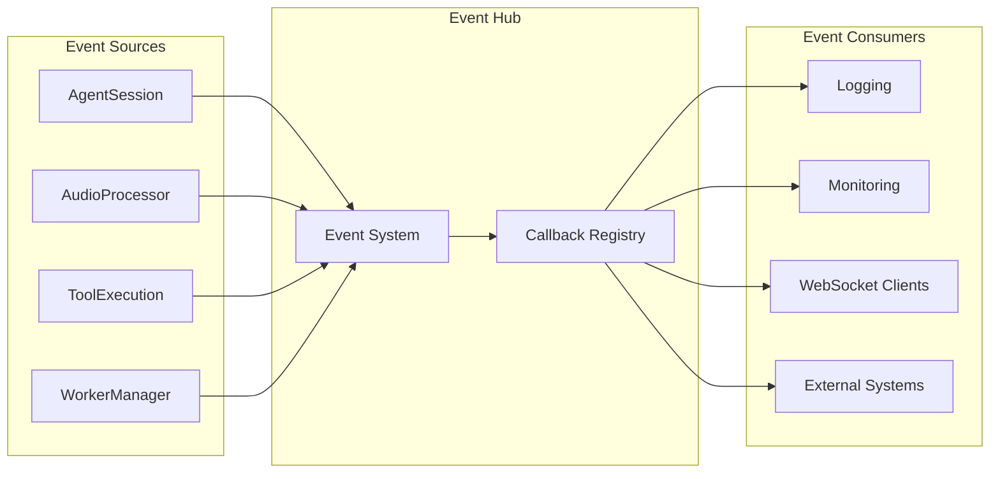

# LivekitexAgent System Flow Documentation

## Overview

LivekitexAgent is a comprehensive Elixir library that provides voice AI agent capabilities by integrating real-time audio processing, AI language models, and function tools into a cohesive conversational system. This documentation provides a complete understanding of how the agent system operates from initialization through real-time conversation handling.

## Table of Contents

1. [Overview](#overview)
2. [Key Capabilities](#key-capabilities)
3. [System Overview](#system-overview)
   - [High-level Architecture](#high-level-architecture)
   - [Core Components](#core-components)
   - [Data Flow Patterns](#data-flow-patterns)
4. [Agent Lifecycle](#agent-lifecycle)
   - [Agent Initialization](#agent-initialization)
   - [Real-time Conversation States](#real-time-conversation-states)
   - [Agent Termination](#agent-termination)
5. [Session Management](#session-management)
   - [Session Creation and Lifecycle](#session-creation-and-lifecycle)
   - [State Management Patterns](#state-management-patterns)
   - [Resource Management](#resource-management)
6. [Turn Management](#turn-management)
   - [Audio Processing Pipeline](#audio-processing-pipeline)
   - [Conversation Turn Detection](#conversation-turn-detection)
   - [Interruption Handling](#interruption-handling)
7. [Tool Execution](#tool-execution)
   - [Function Tool Architecture](#function-tool-architecture)
   - [Tool Registry System](#tool-registry-system)
   - [Execution Flow Patterns](#execution-flow-patterns)
8. [Event System](#event-system)
   - [Event Architecture](#event-architecture)
   - [Event Categories](#event-categories)
   - [Event Handler Patterns](#event-handler-patterns)
9. [Appendices](#appendices)
   - [A. OpenAI API Integration Patterns](#a-openai-api-integration-patterns)
   - [B. Error Handling and Fallback Pipeline](#b-error-handling-and-fallback-pipeline)
   - [C. LiveKit Integration Details](#c-livekit-integration-details)
10. [Future Enhancements](#future-enhancements)

### Key Capabilities

The LivekitexAgent system enables:
- **Real-time voice conversations** with sub-100ms audio processing latency
- **Intelligent function calling** allowing agents to use external tools and APIs
- **Multi-modal interactions** supporting audio, text, and video streams
- **Production-ready deployment** with scaling, monitoring, and fault tolerance
- **Flexible integration** with existing applications and external services

### System Architecture

The LivekitexAgent system is built on a layered architecture that separates concerns while enabling real-time performance:

#### External Integration Layer
- **LiveKit Infrastructure**: WebRTC-based real-time communication platform
- **OpenAI APIs**: Language models (LLM), speech processing (STT/TTS), and realtime streaming
- **External Services**: Function tools can integrate with any HTTP/WebSocket API

#### Core Agent System
- **Agent Configuration**: Defines agent behavior, instructions, and available tools
- **AgentSession**: Orchestrates real-time conversations and manages agent state
- **WorkerManager**: Distributes jobs across worker pools for scalability
- **ToolRegistry**: Manages function tool registration and execution

#### Infrastructure Layer
- **WorkerSupervisor**: OTP supervision for fault tolerance and process management
- **JobContext**: Manages job lifecycle and participant handling
- **HealthServer**: Provides monitoring endpoints and system health metrics

### Core Data Flow

The system follows a clear data flow pattern for handling conversations:

1. **Initialization**: Agent configuration loaded, tools registered, external connections established
2. **Audio Input**: User speech captured through LiveKit WebRTC infrastructure
3. **Processing Pipeline**: Audio processed through STT → LLM → Tool Execution → TTS
4. **Real-time Response**: Agent response streamed back to user through audio output
5. **State Management**: Conversation state maintained across multiple turns

### Performance Characteristics

The system is designed for real-time performance with specific targets:
- **Audio Latency**: < 50ms for audio processing pipeline
- **End-to-End Response**: < 100ms from user input to agent response start
- **Concurrent Capacity**: 100+ simultaneous conversations per worker
- **Tool Execution**: Sub-500ms for most function tool operations

---

## Agent Lifecycle

The Agent represents the core configuration and capabilities of a conversational AI. Understanding the agent lifecycle is essential for implementing and debugging agent behaviors.

### Agent States and Transitions



#### State Descriptions

**Created**: Initial state after `Agent.new()` call
- Agent structure initialized with default values
- No external connections or validations performed
- Ready for configuration setup

**Configured**: Agent configuration validated and locked
- Instructions, tools, and provider settings validated
- Tool registry updated with agent's available functions
- External API credentials verified (optional)
- Ready for session creation

**Active**: Agent running within an AgentSession
- Real-time conversation processing enabled
- All external connections established (LiveKit, OpenAI)
- Function tools available for execution
- Performance monitoring active

**Inactive**: Agent temporarily stopped but preserving state
- External connections gracefully closed
- Configuration and tool registry preserved
- Can be reactivated without full reinitialization
- Useful for resource management or temporary shutdowns

**Destroyed**: Agent permanently terminated
- All resources released and connections closed
- Configuration cleared from memory
- Cannot be reused - new agent must be created
- Final state in agent lifecycle

### Agent Configuration Components

#### Instructions and Behavior
```elixir
agent = LivekitexAgent.Agent.new(
  instructions: """
  You are a helpful voice assistant for customer service.
  Be concise, friendly, and professional in all interactions.
  Always use available tools to provide accurate information.
  """,
  agent_id: "customer_service_agent_v1"
)
```

#### Tool Registration
```elixir
agent = LivekitexAgent.Agent.new(
  instructions: "You are a helpful assistant with access to useful tools.",
  tools: [:get_weather, :search_database, :send_email, :create_ticket],
  agent_id: "support_agent"
)
```

#### Provider Configuration
```elixir
agent = LivekitexAgent.Agent.new(
  instructions: "You are a voice assistant.",
  llm_config: %{
    provider: :openai,
    model: "gpt-4-turbo",
    temperature: 0.7,
    max_tokens: 1000
  },
  stt_config: %{
    provider: :openai,
    model: "whisper-1",
    language: "en"
  },
  tts_config: %{
    provider: :openai,
    model: "tts-1",
    voice: "alloy"
  }
)
```

---

## Session Management

The AgentSession is the runtime component that orchestrates all aspects of real-time conversation. It manages the complex coordination between audio processing, AI providers, tool execution, and user interaction.

### Session Initialization Process

The session initialization follows a specific sequence to ensure all components are ready for real-time interaction:



#### Initialization Steps

1. **Job Context Creation**: WorkerManager creates JobContext with unique job ID and metadata
2. **Session Startup**: AgentSession GenServer started with agent configuration
3. **Configuration Loading**: Agent instructions, tools, and provider settings loaded
4. **Tool Registration**: Function tools registered in global ToolRegistry
5. **External Connections**: LiveKit room connection and OpenAI provider initialization
6. **Ready State**: Session signals ready status back to WorkerManager

### Real-time Conversation States

Once initialized, the AgentSession manages conversation through several states:

#### Conversation State Machine



#### State Descriptions

**Idle**: Waiting for user input
- All systems ready and monitoring for audio input
- Background processing minimal to conserve resources
- Ready to transition to Listening on audio detection

**Listening**: Processing incoming audio
- Audio chunks being captured and buffered
- Voice Activity Detection (VAD) monitoring for speech end
- Real-time audio streaming to speech processing pipeline

**Processing**: Converting speech to text
- Speech-to-Text (STT) processing audio buffer
- Audio quality analysis and enhancement if needed
- Preparing text for language model processing

**Thinking**: Language model processing
- LLM analyzing user input and generating response
- Function tool selection and parameter preparation
- Context awareness and conversation memory integration

**ToolExecution**: Running external function tools
- Executing external API calls or database queries
- Processing tool results and formatting for LLM context
- Error handling and fallback tool execution if needed

**Responding**: Generating agent response
- LLM generating natural language response
- Response optimization for conversational flow
- Preparing text for text-to-speech conversion

**Speaking**: Converting response to audio
- Text-to-Speech (TTS) processing agent response
- Audio streaming and real-time playback coordination
- Monitoring for user interruptions during response

**Interrupted**: Handling user interruptions
- Gracefully stopping current processing pipeline
- Preserving conversation context and partial results
- Preparing to resume with new user input

### Session Event System

The AgentSession provides comprehensive event callbacks for monitoring and integration:

#### Event Categories

**Session Lifecycle Events**
```elixir
event_callbacks = %{
  session_started: fn _event, data ->
    Logger.info("Session started: #{data.session_id}")
  end,
  session_stopped: fn _event, data ->
    Logger.info("Session ended: #{data.session_id}, duration: #{data.duration_ms}ms")
  end,
  state_changed: fn _event, data ->
    Logger.debug("State transition: #{data.from_state} → #{data.to_state}")
  end
}
```

**Audio Processing Events**
```elixir
audio_callbacks = %{
  audio_received: fn _event, data ->
    Logger.debug("Audio chunk: #{data.size_bytes} bytes")
  end,
  stt_result: fn _event, data ->
    Logger.info("Transcription: #{data.text}")
  end,
  tts_complete: fn _event, data ->
    Logger.debug("TTS generated: #{data.audio_duration_ms}ms")
  end
}
```

**Tool Execution Events**
```elixir
tool_callbacks = %{
  tool_called: fn _event, data ->
    Logger.info("Tool called: #{data.tool_name} with #{inspect(data.arguments)}")
  end,
  tool_completed: fn _event, data ->
    Logger.info("Tool result: #{data.tool_name} → #{inspect(data.result)}")
  end,
  tool_error: fn _event, data ->
    Logger.error("Tool failed: #{data.tool_name} → #{data.error}")
  end
}
```

---

## Turn Management

Turn management is crucial for natural conversation flow, including proper detection of when users start and stop speaking, and handling interruptions gracefully.

### Turn Detection Mechanisms

#### Voice Activity Detection (VAD)
The system uses Voice Activity Detection to identify when users are speaking:

```elixir
vad_config = %{
  module: LivekitexAgent.SimpleEnergyVAD,
  opts: [
    threshold: 0.3,           # Energy threshold for speech detection
    min_speech_duration: 300, # Minimum 300ms for valid speech
    max_silence_duration: 800 # 800ms silence indicates turn end
  ]
}
```

#### Turn Boundaries
- **Speech Start**: VAD detects audio energy above threshold for minimum duration
- **Speech End**: Sustained silence below threshold for maximum silence duration
- **Turn Complete**: STT processing complete and LLM response ready

### Interruption Handling

The system supports natural conversational interruptions:

#### Interruption Detection
```elixir
# User speaks while agent is responding
interruption_detected = fn audio_energy ->
  cond do
    agent_speaking? and audio_energy > interrupt_threshold ->
      cancel_current_response()
      transition_to_listening_state()

    true ->
      continue_current_processing()
  end
end
```

#### Interruption Recovery
1. **Immediate Stop**: Cancel current TTS generation and audio output
2. **Context Preservation**: Save conversation state and partial responses
3. **Input Processing**: Begin processing new user input immediately
4. **Graceful Resume**: Incorporate interruption context into response generation

---

## Tool Execution

Function tools extend agent capabilities by enabling interaction with external systems, databases, APIs, and services. The tool execution system provides a robust framework for reliable external integrations.

### Tool Registration and Discovery

#### Macro-Based Tool Definition
```elixir
defmodule WeatherTools do
  use LivekitexAgent.FunctionTool

  @tool "Get current weather information for a specific location"
  @spec get_weather(String.t()) :: String.t()
  def get_weather(location) do
    case WeatherAPI.fetch_current_weather(location) do
      {:ok, weather_data} ->
        "Weather in #{location}: #{weather_data.condition}, #{weather_data.temperature}°C"

      {:error, reason} ->
        "Unable to fetch weather for #{location}: #{reason}"
    end
  end

  @tool "Get weather forecast for the next few days"
  @spec get_forecast(String.t(), integer()) :: String.t()
  def get_forecast(location, days \\ 3) do
    # Implementation...
  end
end
```

#### Runtime Tool Registration
```elixir
# Register all tools from a module
{:ok, tool_count} = LivekitexAgent.FunctionTool.register_module(WeatherTools)

# Register individual tools
LivekitexAgent.FunctionTool.register_tool(%{
  name: "custom_search",
  description: "Search internal database for customer information",
  module: CustomerTools,
  function: :search_customers,
  parameters: [
    %{name: "query", type: "string", required: true},
    %{name: "limit", type: "integer", default: 10}
  ]
})
```

### Tool Execution Flow

The tool execution process ensures reliable external integrations with proper error handling:



#### Execution Context (RunContext)

Every tool execution receives a RunContext with session access and utilities:

```elixir
# RunContext provides:
# - Access to current AgentSession
# - Speech handle for controlling audio output
# - Function call metadata
# - User session data
# - Execution logging and metrics

@tool "Search customer database with session context"
@spec search_customers(String.t(), LivekitexAgent.RunContext.t()) :: String.t()
def search_customers(query, context) do
  # Log tool usage
  LivekitexAgent.RunContext.log_info(context, "Searching customers: #{query}")

  # Access user session data
  user_id = LivekitexAgent.RunContext.get_user_data(context, :user_id)

  # Perform search with user context
  results = CustomerDB.search(query, user_context: user_id)

  # Update session metrics
  LivekitexAgent.RunContext.update_metrics(context, :searches_performed, 1)

  format_search_results(results)
end
```

### Error Handling and Resilience

#### Tool Execution Safeguards
```elixir
# Timeout protection
tool_config = %{
  timeout: 5000,              # 5 second timeout
  max_retries: 3,             # Retry failed calls
  retry_delay: 1000,          # 1 second between retries
  fallback_message: "I'm having trouble with that request right now."
}

# Circuit breaker pattern
circuit_breaker = %{
  failure_threshold: 5,       # Trip after 5 failures
  timeout_ms: 30_000,         # 30 second timeout
  recovery_time_ms: 60_000    # 1 minute recovery period
}
```

#### Graceful Degradation
When tools fail, the system provides graceful degradation:

1. **Retry Logic**: Automatic retries for transient failures
2. **Fallback Responses**: Predefined responses when tools are unavailable
3. **Error Context**: Detailed error information for debugging
4. **Conversation Continuity**: Failures don't break the conversation flow

---

## Event System

The event system provides comprehensive observability and integration capabilities through a callback-based architecture that enables real-time monitoring and custom integrations.

### Event Architecture

#### Event Flow and Propagation


#### Event Registration
```elixir
# Register session-level event callbacks
{:ok, session} = LivekitexAgent.AgentSession.start_link(
  agent: agent,
  event_callbacks: %{
    # Conversation events
    turn_started: &handle_turn_start/2,
    turn_completed: &handle_turn_complete/2,
    response_generated: &handle_response/2,

    # Tool events
    tool_called: &log_tool_usage/2,
    tool_completed: &update_tool_metrics/2,

    # Audio events
    audio_received: &process_audio_metrics/2,
    speaking_started: &notify_speaking_state/2,

    # Error events
    session_error: &handle_session_error/2,
    tool_error: &handle_tool_failure/2
  }
)

# Register global event handlers
:telemetry.attach_many(
  "livekitex-agent-events",
  [
    [:livekitex_agent, :session, :started],
    [:livekitex_agent, :session, :completed],
    [:livekitex_agent, :tool, :executed],
    [:livekitex_agent, :audio, :processed]
  ],
  &MyApp.TelemetryHandler.handle_event/4,
  %{}
)
```

### Event Categories and Usage

#### Session Lifecycle Events
Essential for tracking agent session behavior and performance:

```elixir
defmodule SessionEventHandler do
  def handle_session_started(_event, %{session_id: session_id, agent_id: agent_id}) do
    # Track session metrics
    :telemetry.execute([:myapp, :session, :started], %{count: 1}, %{
      session_id: session_id,
      agent_id: agent_id
    })

    # Notify monitoring systems
    MyApp.Monitoring.session_started(session_id, agent_id)
  end

  def handle_turn_completed(_event, %{duration_ms: duration, message_count: count}) do
    # Performance tracking
    :telemetry.execute([:myapp, :turn, :completed], %{
      duration_ms: duration,
      message_count: count
    })

    # Update conversation metrics
    MyApp.Analytics.record_turn_metrics(duration, count)
  end
end
```

#### Real-time Integration Events
Enable live updates to web interfaces and external systems:

```elixir
defmodule RealtimeIntegration do
  def handle_response_generated(_event, %{text: response_text, session_id: session_id}) do
    # Broadcast to web interface
    MyAppWeb.Endpoint.broadcast("session:#{session_id}", "agent_response", %{
      text: response_text,
      timestamp: DateTime.utc_now()
    })
  end

  def handle_tool_called(_event, %{tool_name: tool, arguments: args, session_id: session_id}) do
    # Show tool usage in real-time UI
    MyAppWeb.Endpoint.broadcast("session:#{session_id}", "tool_executing", %{
      tool: tool,
      args: args,
      status: "executing"
    })
  end
end
```

This comprehensive system flow documentation provides developers with complete understanding of LivekitexAgent architecture, from high-level concepts through detailed implementation patterns. The multi-layered approach ensures information is accessible for different experience levels while maintaining technical depth for advanced use cases.

## Appendices

### A. OpenAI API Integration Patterns

The LivekitexAgent integrates with OpenAI's API using several key patterns:

#### A.1 Real-time Streaming API

```elixir
# Stream-based conversation with OpenAI
defp stream_openai_response(context, messages) do
  HTTPoison.post(
    "https://api.openai.com/v1/chat/completions",
    Jason.encode!(%{
      model: "gpt-4o-realtime-preview",
      messages: messages,
      stream: true,
      tools: format_tools(context.available_tools)
    }),
    [{"Authorization", "Bearer #{openai_token()}"}],
    stream_to: self()
  )
end
```

#### A.2 Function Calling Integration

The agent uses OpenAI's function calling feature for tool execution:

```elixir
# Tool schema formatting for OpenAI
def format_tools(tools) do
  Enum.map(tools, fn {name, tool} ->
    %{
      type: "function",
      function: %{
        name: name,
        description: tool.description,
        parameters: tool.schema
      }
    }
  end)
end
```

#### A.3 Audio Processing Pipeline

```elixir
# Audio transcription flow
defp process_audio_with_openai(audio_data) do
  with {:ok, transcript} <- transcribe_audio(audio_data),
       {:ok, response} <- generate_response(transcript),
       {:ok, audio} <- text_to_speech(response) do
    {:ok, %{transcript: transcript, response: response, audio: audio}}
  end
end
```

### B. Error Handling and Fallback Pipeline

The agent implements a comprehensive fallback system for resilient operation:

#### B.1 API Failure Handling

```elixir
defp handle_api_failure(error, context) do
  case error do
    {:rate_limit, retry_after} ->
      schedule_retry(context, retry_after)

    {:network_error, _} ->
      switch_to_backup_provider(context)

    {:invalid_response, _} ->
      use_cached_response(context)

    _ ->
      notify_user_of_issue(context)
  end
end
```

#### B.2 Graceful Degradation

- **No Internet**: Use cached responses and offline capabilities
- **API Rate Limits**: Queue requests with exponential backoff
- **Service Unavailable**: Switch to alternative providers or local models
- **Invalid Responses**: Use template-based fallbacks

#### B.3 Recovery Mechanisms

```elixir
defp attempt_recovery(session, error_type) do
  case error_type do
    :websocket_disconnect ->
      reconnect_with_backoff(session)

    :audio_processing_failure ->
      reset_audio_pipeline(session)

    :tool_execution_timeout ->
      cancel_and_retry_tool(session)
  end
end
```

### C. LiveKit Integration Details

#### C.1 Room Management

```elixir
# LiveKit room connection and management
defp connect_to_room(room_name, participant_token) do
  with {:ok, room} <- LiveKit.Room.connect(room_name, participant_token),
       :ok <- setup_audio_tracks(room),
       :ok <- setup_data_channels(room) do
    {:ok, room}
  end
end
```

#### C.2 Real-time Audio Streaming

```elixir
# Audio track handling
defp handle_audio_track(track, session) do
  track
  |> LiveKit.Track.subscribe()
  |> Stream.chunk_every(160) # 20ms chunks at 8kHz
  |> Stream.each(&process_audio_chunk(&1, session))
  |> Stream.run()
end
```

#### C.3 Data Channel Communication

```elixir
# Bidirectional data communication
defp setup_data_channel(room) do
  channel = LiveKit.Room.create_data_channel(room, "agent-control")

  LiveKit.DataChannel.on_message(channel, fn message ->
    handle_control_message(Jason.decode!(message))
  end)

  {:ok, channel}
end
```

## Future Enhancements

The agent system is designed to support future enhancements:

- Advanced turn detection with speaker identification
- Multi-language support with real-time translation
- Enhanced function calling with parallel execution
- Custom audio processing pipelines
- Advanced error recovery mechanisms
- Real-time analytics and monitoring
- Load balancing across multiple agent instances